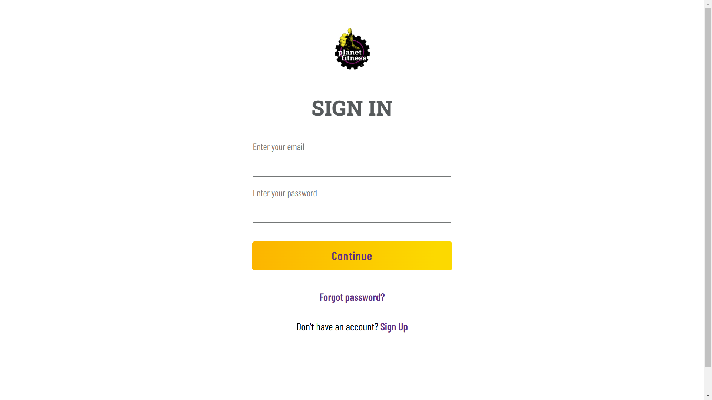

# project-gym-fitness-frontend

Link: https://project-gym-fitness.netlify.app/

This is a clone of planetfitness.com. Planet Fitness is a franchisor and operator of fitness centres. It provides a high-quality workout experience at an affordable cost. It also has different membership options, so we can pick the one that works best for us. All of our PF locations have a variety of high-quality, brand-name cardio and strength equipment.

This website is fully responsive and behaves the same as planetfitness.com in functionality.

## Screenshots:

## Tech-Stack Used:

- HTML
- CSS
- Tailwind CSS
- Local Storage
- JavaScript

## Authors:

- [Uneza Fatima] (https://github.com/UnezaFatima)
- [Medhavi Tuppekar] (https://github.com/Medhavi-18)
- [Viqar Ahmed] (https://github.com/viqar-developer)
- [Manish Sahu] (https://github.com/Manishsahu116)
- [Prakash Chandra Akash] (https://github.com/impcakash)
